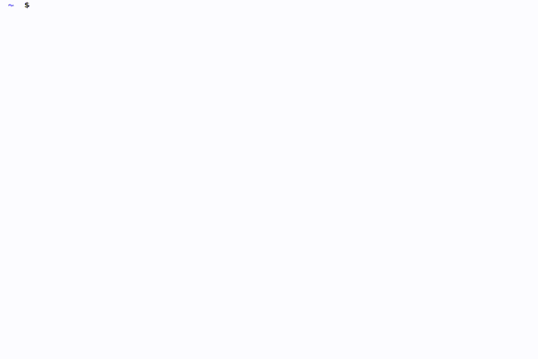

# Command Line Interface

An object oriented command line argument parser and automatic usage documentation framework.

[](https://travis-ci.org/glentner/CLI)
[](http://www.gnu.org/copyleft/gpl.html)


The **CLI** library is a small (and still developing) C++ toolkit for managing the interpretation of
command line arguments. Further, it automatically constructs the appropriate *usage* statement
given the arguments defined in your code.


##TL;DR

Instead of executing the top level portion of your code from *main*, derive an *application class*
from one of either the **CLI::SingleMode** or **CLI::MultiMode** classes.

A **CLI::SingleMode** application is a program that can be run as a single executable function.
A **CLI::MultiMode** application is a program that has more than one separate subcommands
with entirely unique argument sets. These subcommands are in fact themselves **CLI::SingleMode**
objects.

Look at the *docs* for more details.


##Install

Clone or extract this repository where ever you so choose. Simply execute *make* to build the
library. This creates *libCLI.a* under *lib/*. To use the library, simply add the path to *CLI/*
to your include path and link to the archive.
```
CLI_PATH = Path/to/CLI/
IFlags   = -I$(CLI_PATH) ...
LFlags   = -L$(CLI_PATH)/lib -lCLI ...
```


##Examples

The build process compiles two examples (under the *examples/* directory), one **CLI::SingleMode**
and one **CLI::MultiMode** application. *hello.exe* is a basic "Hello, world!" style program
that showcases how to create various styles of arguments. The *calc.exe* program demonstrates
the creation of separate **CLI::SingleMode** objects (*add*, *subtract*, ...) and wrapping
them inside a **CLI::MultiMode** object.


##Demo

